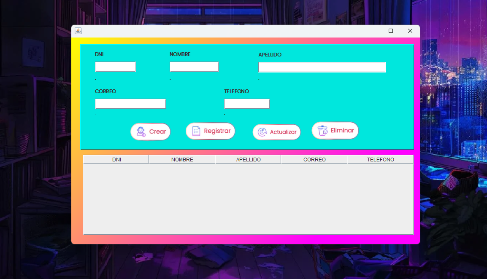

# CRUD_Java_ER
CRUD en Java con Expresiones Regulares

## 📝 Descripción

Es una aplicación CRUD (Crear, Registrar, Actualizar, Eliminar) desarrollada en Java, cuenta con una interfaz amigable. Utiliza un `JTable` para la visualización y gestión de datos de manera ordenada y accesible. Además, implementa el uso de expresiones regulares para la validez y el formato correcto de los datos ingresados.

### ✨ Funcionalidades Principales

- **Crear**: Crea nuevos registros al JTable con facilidad.
- **Registrar**: Agrega Registros de datos al JTable.
- **Actualizar**: Modifica registros existentes sin complicaciones.
- **Eliminar**: Borra registros no deseados de manera segura.
- **Validación**: Asegura que los datos ingresados cumplan con los formatos mediante expresiones regulares.

### ⚙️ Características Técnicas

- **Lenguaje**: Java
- **Interfaz Gráfica**: Swing (`JTable`)
- **Validación de Datos**: Expresiones Regulares
- **Entorno de Programación**: Apache NetBenas IDE 18

## 🖼️ Capturas de Pantalla

